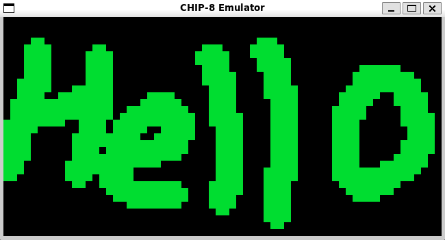
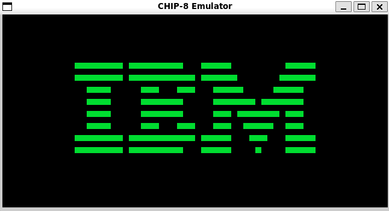
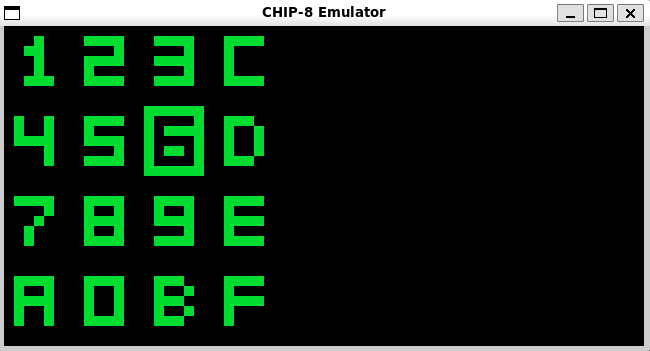

# CHIP-8 Emulator

A CHIP-8 emulator written in C using SDL2.
This was built from scratch as a learning project — no external libraries besides SDL2, and minimal references.


## 📌 Overview

CHIP-8 is a simple interpreted programming language used on some vintage 1970s microcomputers.
This project emulates its virtual machine, including graphics, memory, input, and timers.

The goal was to learn low-level system emulation and SDL2, while building something cool from the ground up.

## 📸 Screenshots

### BMP Viewer ROM


### IBM Logo


### Keypad Test



## ✅ Current Features

- ✅ Full CHIP-8 instruction set (except sound, WIP)
- ✅ Basic font and memory initialization
- ✅ SDL2-based graphics output (64×32 monochrome display)
- ✅ Keyboard input mapped to CHIP-8 keypad
- ✅ Collision detection and VF flag support
- ✅ Support for most popular test/demo ROMs
- ✅ Instruction cycle, timers, and input handling

## 🏗️ Project Structure

```

.
├── Makefile
├── out/                    # Compiled executable
│   └── main
├── src/
│   ├── main.c              # Entry point
│   ├── cpu.c               # Instruction decoding + execution
│   ├── screen.c            # SDL2 display handling
│   └── include/
│       ├── constants.h     # Opcodes and display settings
│       ├── cpu.h
│       ├── instructions.h
│       └── screen.h
└── test-roms/              # Sample CHIP-8 programs
    ├── pong.ch8
    ├── tank.ch8
    ├── bmp\_hello.ch8
    ├── keypad\_test.ch8
    ├── ...

````

## 🧪 Tested ROMs

Includes and tested with:

- Pong
- IBM Logo
- Clock Program
- Random Number Test
- Chip-8 Picture
- Keypad Test
- Tank
- BMP Viewer

All major ROMs tested and verified to work correctly (except sound-based ROMs for now).

## 🛠️ Build Instructions

### Prerequisites

- GCC or any standard C compiler
- SDL2 development libraries (`libsdl2-dev` on Linux)

### Compile

```bash
make
````

### Run

```bash
./out/main path/to/rom.ch8
```


Example:

```bash
./out/main test-roms/pong.ch8
```

### Clean

```bash
make clean
```

## 🔊 To-Do / Upcoming

* [ ] Add proper sound support (BEEP!)
* [ ] More accurate timer emulation
* [ ] Debug mode / logging

## 🧠 Learning Outcomes

* Low-level memory handling
* Emulator architecture
* SDL2 basics (graphics, input, timing)
* Bitwise operations, instruction parsing
* Makefile usage and build system basics


### Made with a lot of C, coffee, and curiosity ☕🧠
